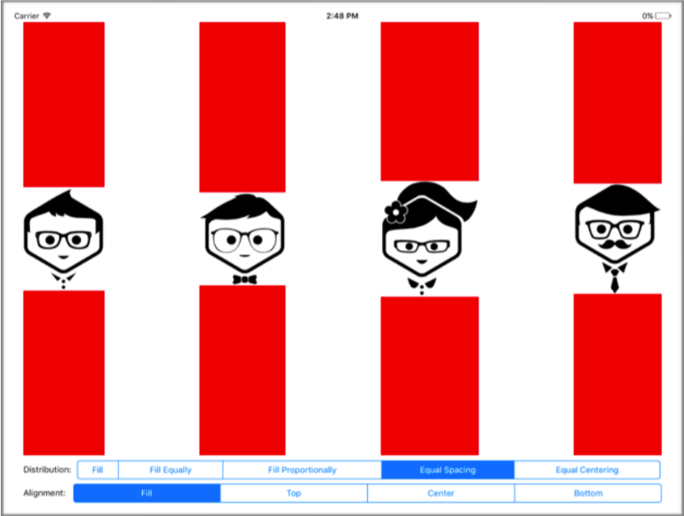
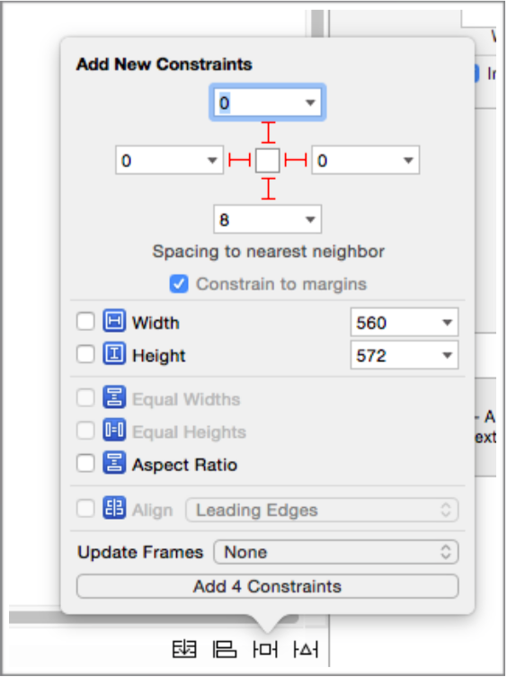
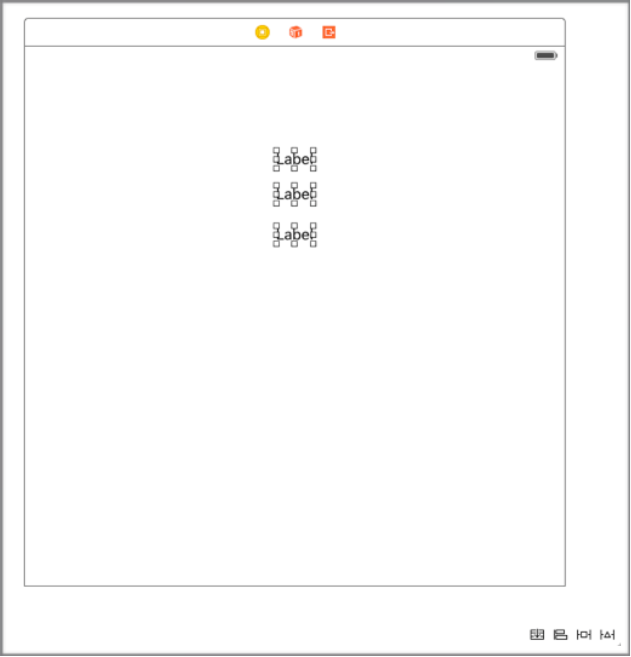

# Day 4 :: UIStackView
iOS9에서 Apple은 여러분의 어플리케이션에서 뷰를 수평 혹은 수직으로 쌓기 위한 간단한 방법을 제공하는 UIStackView를 소개했다. 이러한 뷰는 적응형 UI를 구축하기 쉽게 하는 그들의 자식 뷰의 위치 혹은 크기를 관리하기 위해 오토 레이아웃을 사용한다.

이전에, 만약 여러분이 뷰를 쌓는 종류의 레이아웃을 만들기 원했다면 여러분은 많은 제약이 필요했다. 여러분은 방향에 따라 많은 패딩, 높이, 그리고 x/y 위치 제약과 함께 레이아웃을 관리해야할 필요가 있었다.

UIStackView는 여러분을 위해 이 모든것을 해준다. 심지어는 뷰를 추가하고 숨기고 지울 때와 또한 UIStackView 스스로의 레이아웃 속성을 바꿀 때 사이의 상태를 부드럽게 애니메이션하기 위한  지원도 있다.

###Using UIStackView
이제부터 우리는 UIStackView를 사용하는 방법의 예제를 구축할 것이다. 완성된 코드는 GitHub를 통해 제공되기 때문에 여러분은 따라할 수 있다. 우리는 UIStackView가 어떻게 작동하는 지 간단한 데모를 구축할 것이고 이는 하단에 UIStackView의 정렬과 분포 속성을 제어하는 분할된 컨트롤을 가진다.



위의 그림은 우리가 구축할 것이다. 여러분이 볼 수 있듯이, 우리는 표시된 4명의 친구와 또한 하단을 따라 두개의 분할된 컨트롤을 가지고 있다. 이 UI는 오토 레이아웃을 사용하고 주어진 어느 크기로 적용합니다. 그러므로 이것을 만들 때 우리가 오직 4개의 레이아웃 위치 제약만 추가해도 된다는 것이 여러분을 놀라게 할 것이다.

이 뷰에서 모든것은 UIStackView와 함께 배치된다. 전체적으로 우리는 4개의 UIStackView를 가지고 있다. 첫 번째 것은 오직 우리가 제약을 추가해야할 필요가 있는 것이다. 이는 우리의 루트 뷰의 안에 스택 뷰를 배치하는 것 이다.



여러분이 뷰 컨트롤러에 수직 스택 뷰를 드래그할 때, 인터페이스 빌더의 오른쪽 하단에 있는 contraint pinning tool을 열고 위의 스크린샷에서 명시된 제약을  추가하자. 이는 메인 스택 뷰를 뷰의 중심에 유지시키고 알맞은 크기로 만든다.

3개의 수평 스택 뷰를 우리가 생성했던 수직 스택 뷰의 안에 드래그하자. 상단의 스택 뷰는 4개의 이미지 뷰를 포함할 것이다. 여러분이 해야할 것은 상단의 스택 뷰에 4개의 새로운 이미지 뷰를 드래그하는 것이다. 우리가 사용하는 각 이미지는 조금 다른 크기를 가지고 있고 우리는 이미지가 왜곡되는 것을 원하지 않기 때문에 각 이미지 뷰의 content mode를 Aspect Fit으로 설정하자. 이는 이미지 뷰의 크기에 관계없이 이미지는 항상 올바른 aspect ratio가 될 것이고 이미지 뷰의 범위에 맞을 것이다.

여러분은 또한 최종 구현에서 각 이미지 뷰 사이에 작은 틈이 있다는 것을 알 수 있다. 이는 상단의 스택 뷰가 선택된 동안 인터페이스 빌더의 attributes inspector에서 spacing 속성에 의해 설정된 것이다. 이는 여러분이 또한 alignment와 distribution 속성을 설정할 수 있는 곳이다. 우리는 분할된 컨트롤의 선택된 부분을 바탕으로 이들을 수정할 것이기 때문에 지금은 이 두개의 속성을 "Fill"로 설정해두자.

우리의 루트 스택 뷰에 있는 나머지 두개의 스택 뷰 또한 수평 스택 뷰이다. 이는 간단한 스택 뷰이고 각각 레이블과 분할된 컨트롤을 가지고 있다. 여러분이 distribution과 alignment 레이블과 분할된 컨트롤을 추가할 때 컨트롤을 다음의 부분을 가지도록 설계하자:

* Distribution
* Fill
* Equally
* Fill Proportionally
* Equal Spacing
* Equal Centering
* Alignment
* Fill
* Top
* Center
* Bottom

우리는 각 속성들이 무엇을 하는지 시각적인 데모를 볼 것이지만 they should be fairly self explanatory. 몇몇 속성이 스택 뷰 콘텐츠의 contentSizes와 매우 의존적인 것은 가치가 있다. 고맙게도 우리의 경우에 이미지 크기는 이미지 자체 크기이기 때문에 이것은 간단하다.

현재 우리의 UI가 만들어졌고 우리는 유저가 다른 부분(segment)을 선택할 때 실제로 무엇을 해야할 필요가 있다. 처음으로 이미지 뷰를 포함한 상단 스택 뷰로부터 여러분의 뷰 컨트롤러 서브클래스로 IBOutlet을 드래그하고 peopleStackView라고 명명하자. 그리고 이벤트를 변경하는 분할된 컨트롤의 값으로부터 여러분의 클래스로 IBAction을 드래그하자. 각 함수에서 여러분은 유저에 의해 선택된 부분을 바탕으로 peopleStackView의 alignment 혹은 distribution 속성을 설정하길 원할 것이다.

```swift
@IBAction func alignmentSegmentSelected(sender: UISegmentedControl) {
	UIView.animateWithDuration(1.0,
		delay: 0,
		usingSpringWithDamping: 0.5,
		initialSpringVelocity: 0.2,
		options: .CurveEaseInOut,
		animations: { () -> Void in
			if sender.selectedSegmentIndex == 0 {
				self.peopleStackView.alignment = .Fill
			}
			else if sender.selectedSegmentIndex == 1 {
				self.peopleStackView.alignment = .Top
			}
			else if sender.selectedSegmentIndex == 2 {
				self.peopleStackView.alignment = .Center
			}
			else if sender.selectedSegmentIndex == 3 {
				self.peopleStackView.alignment = .Bottom
			}
		},
		completion: nil)
}

@IBAction func distributionSegmentSelected(sender: UISegmentedControl)
{
	UIView.animateWithDuration(1.0,
		delay: 0,
		usingSpringWithDamping: 0.5,
		initialSpringVelocity: 0.2,
		options: .CurveEaseInOut,
		animations: { () -> Void in
			if sender.selectedSegmentIndex == 0 {
				self.peopleStackView.distribution = .Fill
			}
			else if sender.selectedSegmentIndex == 1 {
				self.peopleStackView.distribution = .FillEqually
			}
			else if sender.selectedSegmentIndex == 2 {
				self.peopleStackView.distribution = .FillProportionally
			}
			else if sender.selectedSegmentIndex == 3 {
				self.peopleStackView.distribution = .EqualSpacing
			}
			else if sender.selectedSegmentIndex == 4 {
				self.peopleStackView.distribution = .EqualCentering
			} 
		},
		completion: nil)
}
```

여러분은 시각적인 감각의 한 조각을 위한 애니메이션 블록에서 각 함수의 감싸진 코드를 볼 수 있지만 그것은 반드시 필요하진 않다. 그것은 만약 여러분이 애니메이션 코드를 지우면 즉시 변경될 것이다. 지금 남겨진 모든 것은 빌드하고 실행하는 것 이다!

distriution과 alignment의 다른 조합들과 함께 플레이를 시도해보자. 이는 많은 디바이스에서 완벽하게 동작하는 인터페이스를 제작하기 위해 여러분을 도와줄 때 UIStackView가 얼마나 강력한지 보여준다.

###Adding existing views to UIStackView
만약 여러분이 UIStackView 레이아웃을 사용하기 위해 변환하고 싶은 존재하는 UI를 가지고 있다면 간단하게 여러분의 뷰에 있는 제약을 지운뒤 그들을 선택하고 인터페이스 빌더 윈도우의 우측 하단에 있는 가장 왼쪽의 버튼을 하자. 이는 여러분의 뷰를 새로운 UIStackView로 바꾸고 빠르게 정렬해준다.



이는 레이아웃을 기반으로 여러분의 존재하는 제약을 여러분을 위한 제약 레이아웃의 대부분을 관리할 수 있는 간단한 스택 뷰로 변환할 것 이다.

###Further Reading
Xcode7에서 Storyboard Reference의 더 많은 정보를 위해서는 WWDC session 218, Auto Layout의 신비함, Part.1을 보는 것을 추천한다. Jason Yao는 UIStackView의 기초를 비디오의 첫 15분에서 다뤘고 과거에서 여러분이 필요했던 것 보다 적은 제약으로 어떻게 인터페이스를 만들 수 있는지 보여주는 데모를 만들었다.
