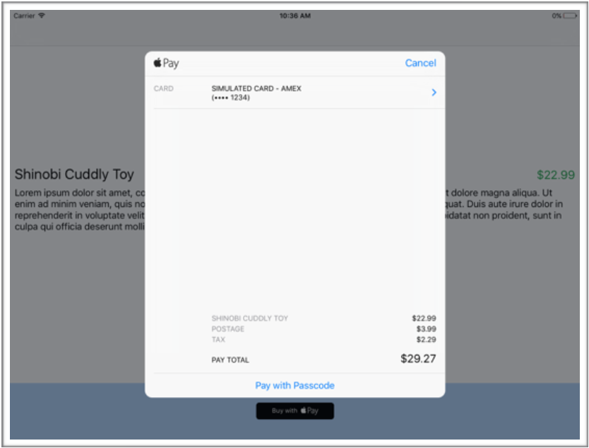
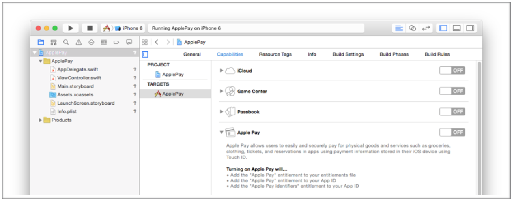
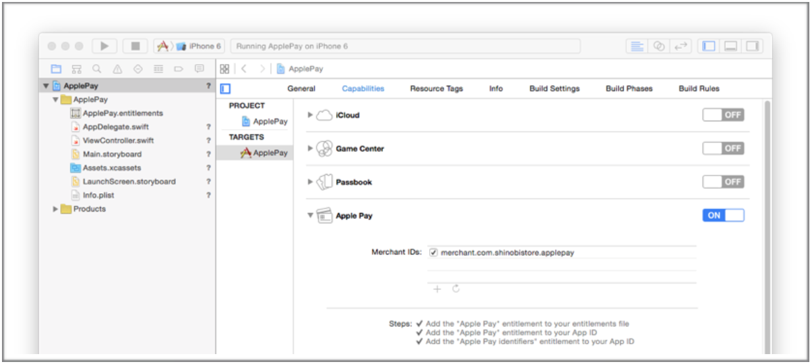
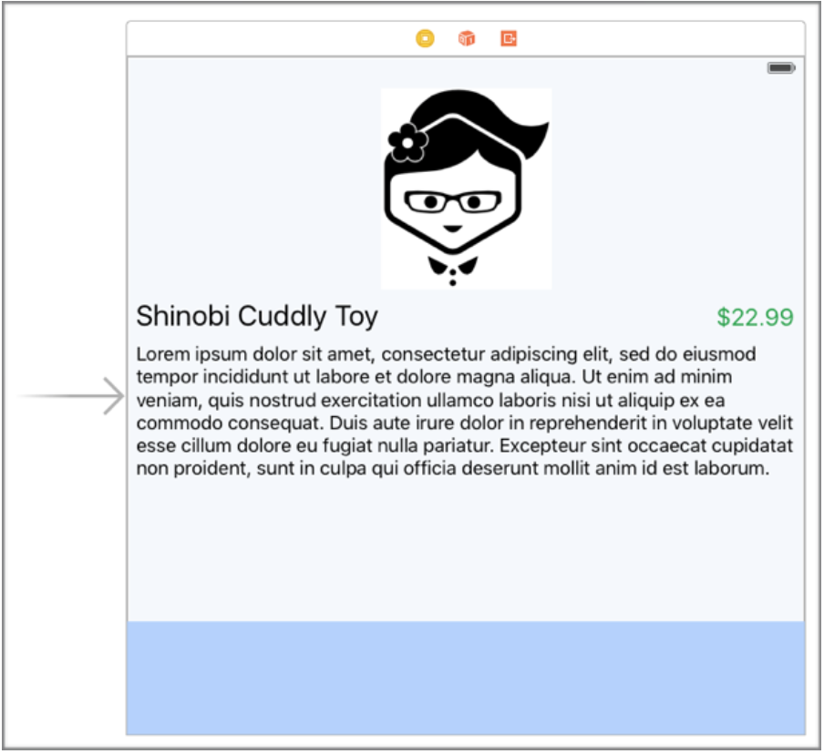
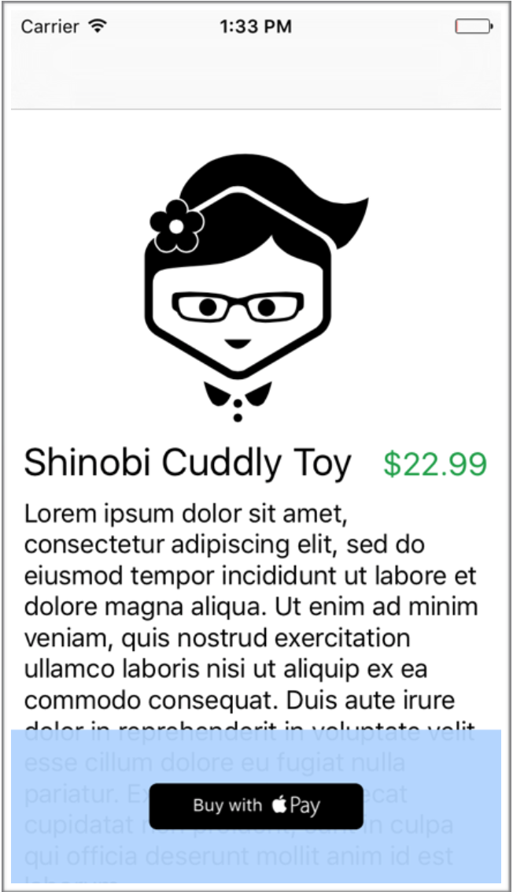
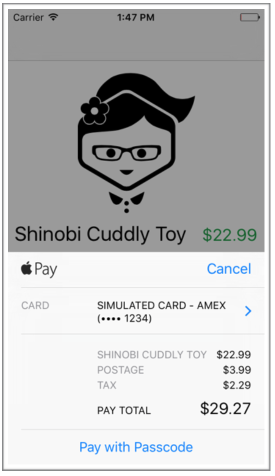
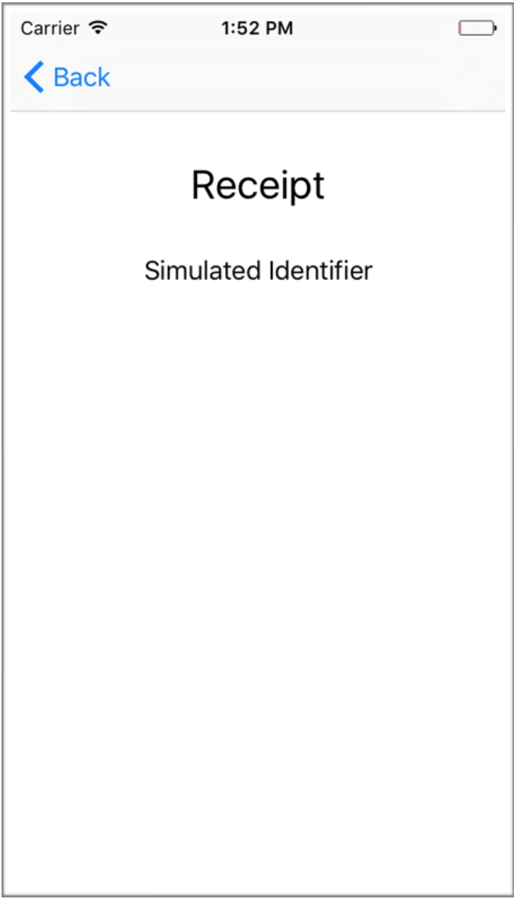

#DAY 8 :: Apple Pay
애플페이는 iOS 8 에서 소개되었다. 간단하고 안전하며 비공개적인 방법으로 실제 상품과 서비스에 대한 지불을 할 수 있다. 유저들이 지문인식으로 쉽게 지불에대한 승인을 할 수 있게 해준다.

애플페이는 특정 디바이스에서만 사용가능하다. iPhone 6, iPhone 6+, iPad Air 2, iPad mini 3 이 이에 해당된다. 그 이유는 애플페이가 중요한 정보를 암호화 하여 저장하는 Secure Element라는 칩을 지원해야 하기 때문이다.

애플페이는 앱의 특정 기능 잠금 해제용으로 쓰여서는 안된다. 이런 곳에는 인앱구매를 사용하는게 맞다. 애플페이는 실제 상품과 서비스, 예를 들면 회원권, 호텔 예약 및 티켓 등등 에만 사용해야한다.

## 왜 애플페이를 사용해야 하나
애플페이는 개발자에게 많은 일을 덜어 준다. 더이상 실제 카드 번호를 받고 처리할 필요가없다, 또한 유저가 가입할 필요도 없다. 가입절차나 회원정보가 더이상 필요 없어지는 것이다. 배송 및 결제 정보는 자동으로 애플페이 토큰을 통해 지불 프로세서로 전송이된다. 이는 더 쉬운 결제 프로세스를 제공한다는 뜻이고, 더 높은 전환율에 도달할 수 있다.

WWDC 세션 702, [Apple Pay Within Apps](https://developer.apple.com/videos/play/wwdc2015-702/) 에서 Nick Shearer가 미국의 다양한 기업에서의 이러한 전환율에 대한 몇가지 통계를 했다.
- Stubhub에서는 애플페이 고객들이 일반 고객보다 20%를 더 거래를 한 것으로 나타났다.
- OpenTable에서는 애플페이 도입 후 거래율이 50% 상승했다.
- Staples에서는 애플페이 도입 후 전환율이 109% 증가했다.

##간단한 스토어 앱 만들기
이제 앱안에 간단한 스토어를 만들고 애플페이가 어떻게 트랜잭션을 처리하는지 볼 것이다. 앱은 한개의 제품만 제공하지만, 애플페이를 완전히 써서 어떻게 설정하고 사용하는지를 볼 것이다.



위 화면이 우리가 만들 화면이다. 보다시피, buy now 버튼을 눌렀을때 애플페이 시트가  제공된다.

##애플페이 활성화
코딩을 시작하기 전에, 애플페이가 작동 가능하도록 설정 해주어야 한다. 빈 프로젝트 생성후, 프로젝트 설정에 가서 Capabilities 설정을 연다.



Capabilities 밑에 애플페이 항목이 보일것이다. ON으로 바꿔주면 프로비져닝에 사용될 개발팀을 물어볼것이다. 나머지는 Xcode가 알아서 애플페이에대한 정보를 추가해줄 것이다.
이제 애플페이가 암호화를 제대로 할 수 있게 Merchant ID(판매자 아이디)를 추가하자. Merchant ID 영역에 추가 버튼을 클릭해서 본인의것을 기입한다. 이 예제에서는 merchant.com.shinobistore.appleplay를 사용하였다.



끝이다. 애플페이가 활성화 되었고 앱에서 사용 할 수 있을 것이다.

##애플페이 사용하기
이제 맞는 프로비져닝과 권한을 설정했으니, 사용자가 결제 할 수 있는 UI를 만들 준비가 되었다. 제품이 판매 가능하다는 것을 보여주기 위해 스토리보드를 열고 플레이스홀더 UI를 연다.



UI 는 간단한 이미지, 제목, 가격, 내용 을 만든다. 데모에 있어 딱히 중요하지는 않다. 단 버튼은 필요로 한다 때문에 하단에 버튼을 넣어주자. 우리가 추가할 버튼은 `PKPaymentBUtton`이다. iOS 8.3 에서 애플이 소개한바 있다. 이 애플페이 버튼은 현지화 되어있으며, 사용자가 애플페이를 쓸 수 있을때 표준적인 시각적 버튼을 제공한다. 때문에 애플에서는 애플페이를 사용할 때에 이 버튼을 사용하는것을 강력히 추천 한다.

버튼은 세가지 스타일을 제공한다:
- White
- WhiteOutline
- Black

또한 두가지 타입의 버튼을 제공한다:
- Plain
- Buy

이건 몇개의 버튼의 스타일이며 아쉽게도 인터페이스 빌더에서는 아직 제공되지 않는다. 때문에 ViewController.swift 를 열어서 viewDidLoad 함수를 overide 해준다.

```swift
override func viewDidLoad() {
       super.viewDidLoad()
       let paymentButton = PKPaymentButton(type:.Buy, style:.Black)
       paymentButton.translatesAutoresizingMaskIntoConstraints = false
       paymentButton.addTarget(self, action: "buyNowButtonTapped", forControlEvents: .TouchUpInside)
       bottomToolbar.addSubview(paymentButton)
       bottomToolbar.addConstraint(NSLayoutConstraint(item: paymentButton, attribute: .CenterX, relatedBy: .Equal, toItem: bottomToolbar, attribute: .CenterX, multiplier: 1, constant: 0))
       bottomToolbar.addConstraint(NSLayoutConstraint(item: paymentButton, attribute: .CenterY, relatedBy: .Equal, toItem: bottomToolbar, attribute: .CenterY, multiplier: 1, constant: 0))
   }
```

이게 끝이다. 코드만 대충 읽어 봐도 뭔지 알 수 있으니 계속 이어가자. 여기서는 버튼이 제일 중요하다. 구매 에 대한 프로세스를 버튼을 누르면 실행되는 `buyNowButtonTapped:`에 넣어주겠다.



UI 를 다 만들었으면 이제 구매 프로세스를 만들자. 일단은 애플페이 트랜잭션에 대한 확실한 이해가 있으면 좋을것이다.

###PKPaymentSummaryItem
애플페이 요금 시트에 청구할 아이템이다. 어떻한 제품도 가능하다, 예로 들자면 세금, 배송비 같으것을 넣을 수 있다.

###PKPaymentRequest
PKPaymentRequest는 청구할 아이템과 유저가 어떻게 지불 할지에 대한 항목을 결합한다. 판매자 식별자, 국가 코드, 통화 등이 들어 있다.

###PKPaymentAuthorisationViewController
PKPaymentAuthorisationViewController는 유저에게 PKPaymentRequest 에대한 권한을 물어보고, 주소지와 결제 카드를 선택하게 한다.

###PKPayment
PKPayment는 결제 프로세스에 대한 정보와 확인 메세지 표시하는 정보를 들고있다.

위 모든 클래스들이 PassKit 안에 있다(따라서 PK 접두사), 그러니 항상 애플페이를 사용할때 해당 프레임웍을 추가 해줘야 한다.

##결제 설정
첫번째로 `PKPaymentRequest`를 만들자. 이를 위해 몇가지 단계가 필요하다. 아래에 자세히 나와있다.

```swift
   func buyNowButtonTapped(sender: UIButton) {
       // 허용할 네트워크
       let paymentNetworks = [PKPaymentNetworkAmex,
           PKPaymentNetworkMasterCard,
           PKPaymentNetworkVisa,
           PKPaymentNetworkDiscover]
```

우선 결제 가능한 네트워크 배열을 설정한다. 이를 이용해 특정 카드를 제한하거나 허용 할 수 있다.

```swift
   if  PKPaymentAuthorizationViewController.canMakePaymentsUsingNetworks(paymentNetworks) {
```

디바이스가 위의 결제가 가능한지 확인한다. `PKPaymentAuthorizationViewController`에 static method인 `canMakePaymentsUsingNetworks`가 디바이스가 결제가 가능한지 확인하고 또한,

```swift
   let request = PKPaymentRequest()
   // 이 merchantIdentifier는 Xcode에서 애플페이를 설정했을때 넣었던것과 같아야 한다.
   request.merchantIdentifier = "shinobistore.com.day-by-day."
   // 표준 ISO 국가 코드. 지불을 이행하는 국가.
   request.countryCode = "US" request.currencyCode = "USD"
   request.supportedNetworks = paymentNetworks
   // 3DS 또는 EMV. 지불 플랫폼 또는 프로세서에서 확인
   request.merchantCapabilities = .Capability3DS
```

이 디바이스에서 결제를 진행할 수 있으면, 위의 코드를 사용해서 결제 요청을 할 수 있다. 각 라인의 주석으로 더 자세히 설명 해두었다.

```swift
// 결제 요청할 아이템 설정. 마지막 아이템은 결제 총합산.
let shinobiToySummaryItem = PKPaymentSummaryItem(label: "Shinobi Cuddly Toy", amount: NSDecimalNumber(double: 22.99), type: .Final)
let shinobiPostageSummaryItem = PKPaymentSummaryItem(label: "Postage", amount: NSDecimalNumber(double: 3.99), type: .Final)
let shinobiTaxSummaryItem = PKPaymentSummaryItem(label: "Tax", amount: NSDecimalNumber(double: 2.29), type: .Final)
let total = PKPaymentSummaryItem(label: "Total", amount: NSDecimalNumber(double: 29.27), type: .Final)
```

위와 같이 애플페이 시트에 표시할 제품을 설정했다. 다음 줄에서 request때 `paymentSummaryItems`로 사용될 것이다.

```swift
request.paymentSummaryItems = [shinobiToySummaryItem,
shinobiPostageSummaryItem, shinobiTaxSummaryItem, total]
```

여기서 한가지 흥미로운 점은 배열의 마지막 아이템은 총 사용자가 결제해야 될 총 합산이라는 것이다. 처음엔 이게 분명하지 않았지만, 애플페이는 마지막 아이템에 대해 요금을 청구하게 될것이다. 여기서는 total 에 해당한다. 때문에 결제 시트에 두개 이상의 아이템을 표시하길 원한다면, 스스로 합산을 해서 추가적인 `PKPaymentSummaryItem`의 리스트 끝에 아래와 같이 넣어주어야 한다.

```swift
// request에서 PKPaymentAuthorizationViewController 생성.
let authorizationViewController = PKPaymentAuthorizationViewController(paymentRequest: request)
// delegate를 설정해 결제 승인 결과를 본다.
authorizationViewController.delegate = self
// authorizationViewController 유저에게 보여준다.
presentViewController(authorizationViewController, animated: true,
completion: nil)
```

마지막으로 애플페이 시트를 유저에게 보여주기 위해 request 에서 `PKPaymentAuthorizationViewController`를 생성하고 delegate를 통해 유저에게 보여준다!



이제 `PKPaymentAuthorizationViewController`의 delegate 함수를 만들었는지 확인해야한다. 이 함수를 적용해야 제대로 결제가 이루어졌는지 알 수 있다. 결제가 승인되고 완료되었을때 이에대한 콜백을 받을 수 있다.

`paymentAuthorizationViewController:didAuthorizePayment` 에 공급자와 결제 데이터를 처리해 앱의 상태를 반환해야한다. 여기서 받은 `PKPayment` 오브젝트가 `PKPaymentToken` 토큰 프로퍼티를 갖고있으며, 결제 공급자에게 보내야한다. 이것은 안전하고 암호화된 데이터이다.

```swift
   func paymentAuthorizationViewController(controller: PKPaymentAuthorizationViewController, didAuthorizePayment payment: PKPayment, completion: (PKPaymentAuthorizationStatus) -> Void) {
       paymentToken = payment.token
       // You would typically use a payment provider such as Stripe here using payment.token
       completion(.Success)
       // Once the payment is successful, show the user that the purchase has been successful.
       self.performSegueWithIdentifier("purchaseConfirmed", sender: self)
   }
```

`paymentAuthorizationViewControllerDidFinish` 에서는 간단히 뷰컨트롤러를 dismiss해주면 된다.

```swift
   func paymentAuthorizationViewControllerDidFinish(controller: PKPaymentAuthorizationViewController) {
       self.dismissViewControllerAnimated(true, completion: nil)
   }
```

여기까지가 완료다! 알다시피 실제로 할때는 Stripe와 같은 결제 공급자에게 결제 토큰을 보내면 된다. 하지만 그것은 튜토리얼의 범위 밖이다. 영수증을 보여주기 위해 간단한 뷰컨트롤러도 추가했다. 여기서는 결제 토큰의 `transactionIdentifier`만 표시해준다. 이 문자열이 영수증에 사용될 전역 고유 식별자를 표현한다.



##Further Reading
애플페이에 관한 정보를 더 알아보려면 WWDC 세션 702, [Apple Pay Within Apps](https://developer.apple.com/videos/play/wwdc2015-702/)를 추천한다. 좀 긴 세션이긴 하지만 애플페이에 흥미가 있다면 볼만한 가치가 있다. 중간에 어떻게 결제 프로세스에 대한 user experience(사용자 경험)을 향상시킬지에 대한 아주 좋은 세션이 있다.

또한 애플 개발자 사이트에 [guide to Apple Pay](https://developer.apple.com/apple-pay/)에 애플페이를 추가하기 전에 숙지해야 할 많은 정보가 올라와 있다.
